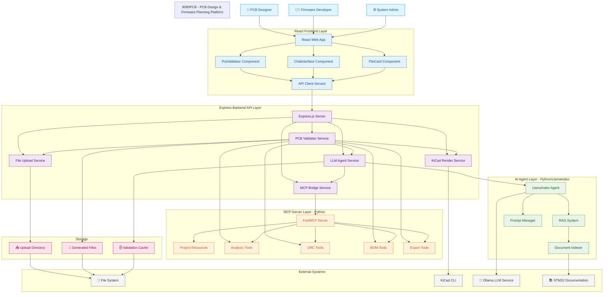
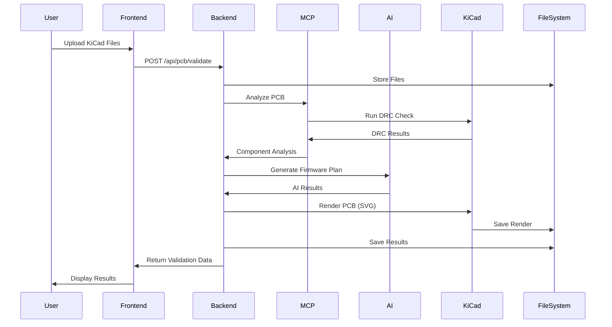
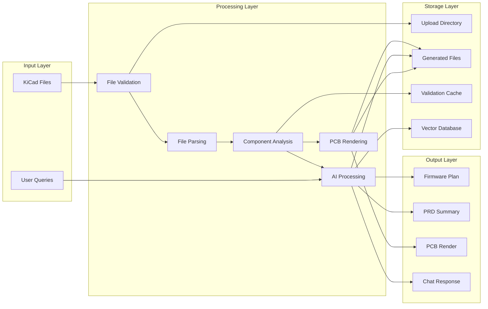
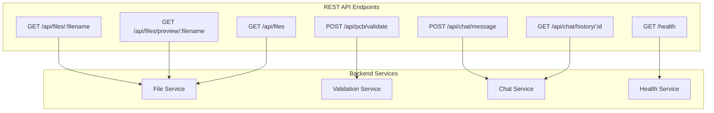
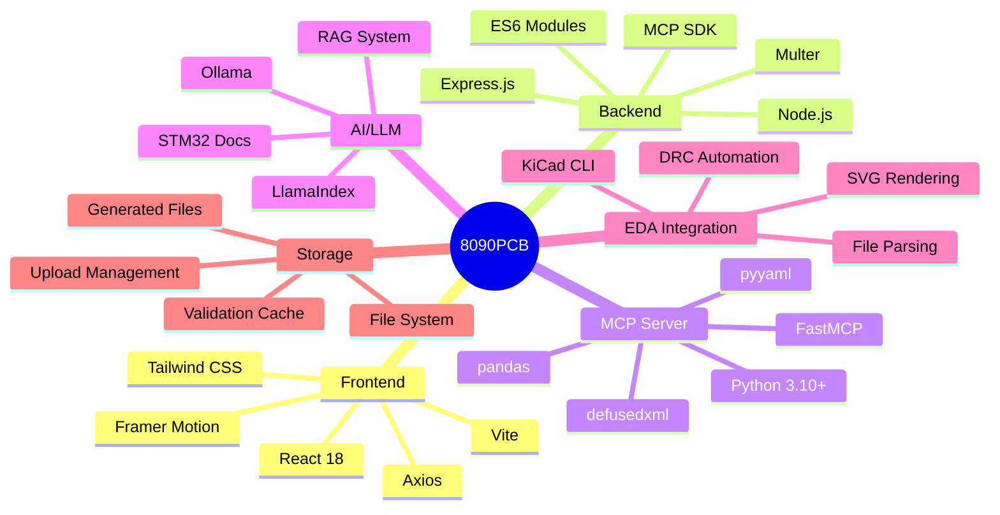
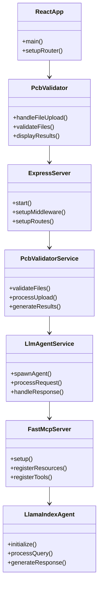
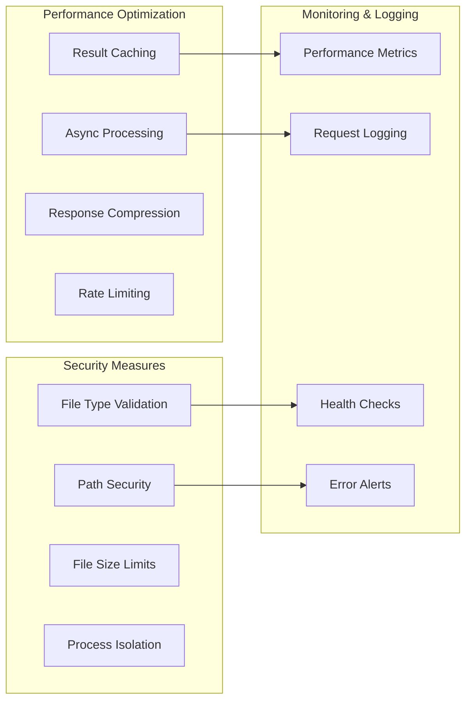

# 8090PCB Project Overview



## User Flow Sequence



## Data Flow Architecture



## API Endpoints Overview



## Technology Stack



## Component Relationships



## Key Features

```mermaid
featureDiagram
    8090PCB --> PCB Analysis
    8090PCB --> Firmware Planning
    8090PCB --> Web Interface
    8090PCB --> AI Integration
    
    PCB Analysis --> File Upload
    PCB Analysis --> Design Rule Check
    PCB Analysis --> Component Extraction
    PCB Analysis --> BOM Generation
    
    Firmware Planning --> AI Analysis
    Firmware Planning --> RAG System
    Firmware Planning --> Structured Output
    Firmware Planning --> Risk Assessment
    
    Web Interface --> Drag & Drop
    Web Interface --> Real-time Feedback
    Web Interface --> File Management
    Web Interface --> Results Display
    
    AI Integration --> Local LLM
    AI Integration --> Document Retrieval
    AI Integration --> Context Awareness
    AI Integration --> Multi-modal Output
```

## Performance & Security Considerations


